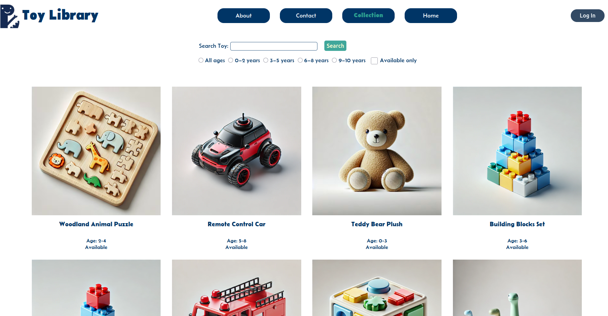
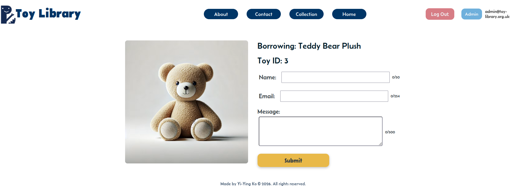
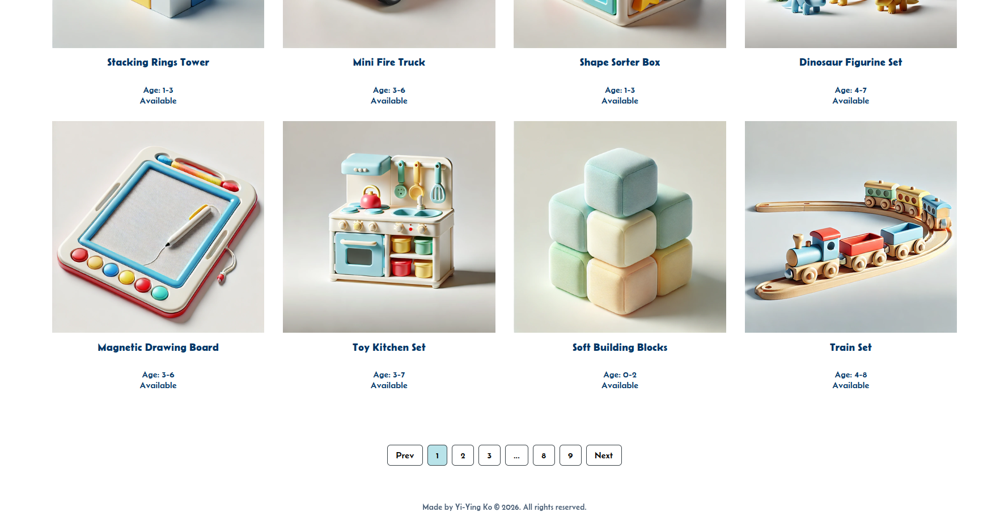
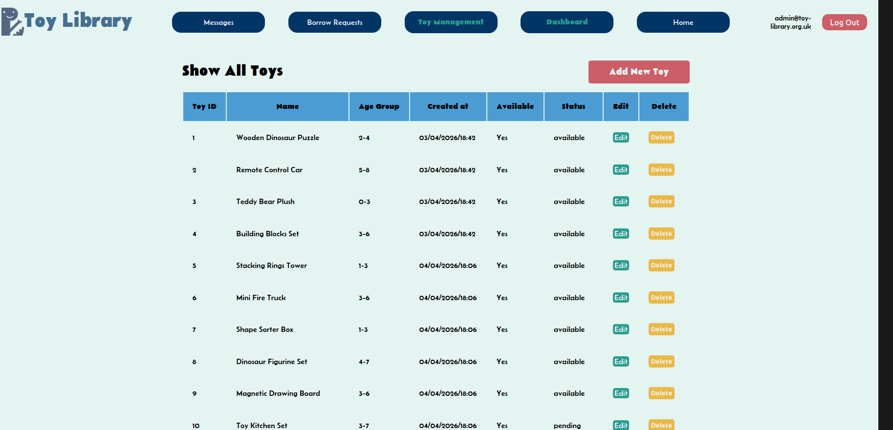
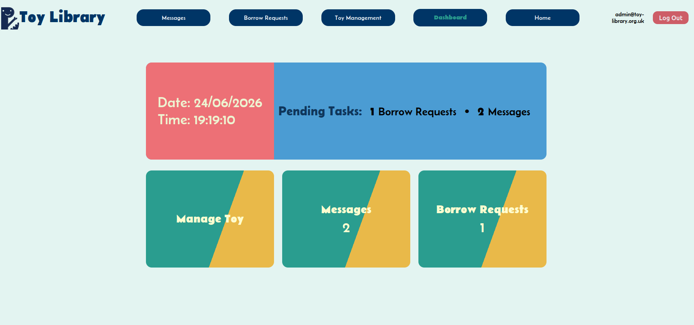
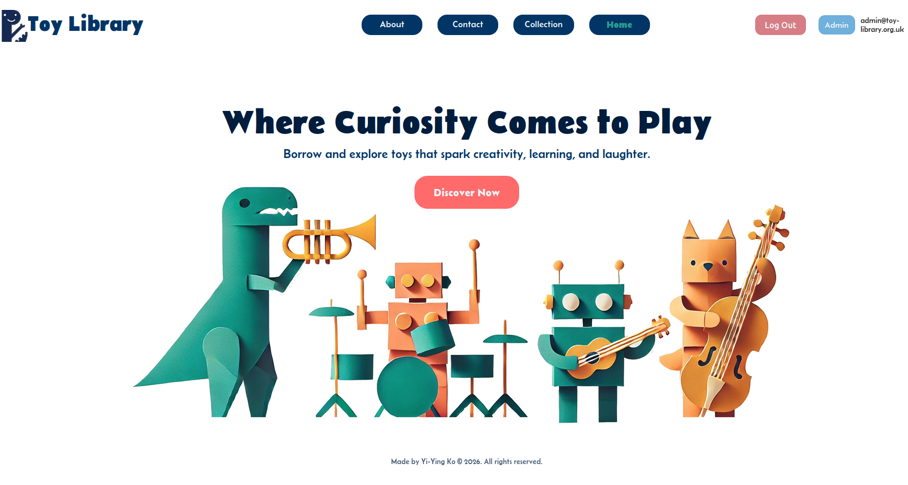

# Toy Library

### A full-stack toy lending platform that allows families to browse and filter available toys, submit borrowing requests, and contact the library. Administrators can manage toys, review borrowing requests, and monitor activity through a protected dashboard.

---

## About The Project

Toy Library was created to simulate a real-world toy lending service while providing a practical environment to design, develop, and deploy a full-stack application.

The project focuses on inventory management, borrowing workflows, authentication, dynamic search and filtering, image uploads, and production deployment.

Version 2.1 introduces improved toy discovery through pagination and filtering, alongside a migration of the backend from JavaScript to TypeScript.

---

## Live Demo

Frontend: https://toylibrary.netlify.app/

---

## Portfolio Demo

This application is a portfolio project and demonstration environment.

Administrative functionality is protected. Some data may be periodically reset during development and testing.

---

## Screenshots

<p align="center">
  
  
</p>

<p align="center">
  
  
</p>

<p align="center">

  
</p>

---

## Features

### V2.1

### Public Features

- Browse available toys
- Search toys by keyword
- Filter toys by age range
- Filter toys by availability
- Paginated toy browsing
- View individual toy details
- Submit borrowing requests
- Contact the toy library

### Admin Features

- Secure authentication with Auth0
- Protected admin routes
- Dashboard with activity summary
- View and manage borrowing requests
- Approve or reject borrowing requests
- Mark borrowing requests as completed
- Automatically synchronise toy availability with borrowing status
- View contact messages
- Add new toys
- Edit existing toys
- Upload toy images using Cloudinary

### V2.1 Technical Improvements

- Migrated the Express backend from JavaScript to TypeScript
- Added TypeScript typing for routes, request parameters, database interactions, and error handling
- Added dynamic SQL filtering using parameterised queries
- Reused filtering conditions for paginated results and total-count queries
- Added `LIMIT` and `OFFSET` pagination to the toys API
- Added overlapping age-range filtering
- Added availability filtering

---

## Tech Stack

### Frontend

- React
- TypeScript
- Vite
- React Router DOM
- React Hook Form
- CSS (BEM methodology)

### Backend

- Node.js
- Express.js
- TypeScript
- MySQL

### Authentication

- Auth0

### Media Storage

- Cloudinary

### Deployment

- Netlify (Frontend)
- Railway (Backend API)
- Aiven (Managed MySQL)

---

## Architecture

```txt
React + TypeScript (Netlify)

            ↓

Express + TypeScript API

         (Railway)

            ↓

      MySQL (Aiven)

Auth0 ───────┘

Cloudinary ──┘
```

---

## Project Structure

```txt
toy-library/

├── client/
│   ├── src/
│   ├── public/
│   └── ...
│
├── server/
│   ├── routes/
│   ├── db.ts
│   ├── server.ts
│   └── ...
│
└── netlify.toml
```

---

## Database Design

### Toys

Stores toy information including:

- Name
- Description
- Age group
- Tags
- Image URL
- Availability status

### Borrow Requests

Stores borrowing requests including:

- Borrower details
- Requested toy
- Request status
- Submission date

### Contact Messages

Stores enquiries submitted through the contact form.

---

## Borrowing Workflow

### Pending

A borrowing request has been submitted and awaits review.

### Approved

The request has been approved and the toy becomes unavailable.

### Rejected

The request has been reviewed but not approved.

### Completed

The toy has been returned and becomes available again.

---

## Search, Filtering & Pagination

The toys API supports multiple optional query parameters that can be combined dynamically.

Examples include:

```http
GET /toys?page=1&limit=12
```

```http
GET /toys?search=puzzle
```

```http
GET /toys?age=3-5
```

```http
GET /toys?available=true
```

Filters can also be combined:

```http
GET /toys?search=wooden&age=3-5&available=true&page=1&limit=12
```

The backend builds SQL conditions dynamically while keeping user input parameterised.

The same filtering conditions are reused for both:

- Retrieving the current page of toys
- Calculating the total number of matching results

This keeps pagination accurate when filters are applied.

Age filtering uses overlapping ranges rather than requiring an exact match. For example, a toy suitable for ages `5-7` can appear when filtering for ages `6-8`.

---

## Authentication & Security

Admin functionality is protected using Auth0 authentication.

Only authenticated users can access:

- Dashboard
- Toy management
- Borrow request management
- Message management

Protected backend routes validate JWT access tokens before allowing administrative operations.

Database queries that include user-controlled filtering values use parameterised SQL queries rather than interpolating input directly into SQL.

---

## Environment Variables

### Client

Create `client/.env`

```env
VITE_API_URL=http://localhost:3001

VITE_AUTH0_DOMAIN=
VITE_AUTH0_CLIENT_ID=
VITE_AUTH0_AUDIENCE=
```

### Server

Create `server/.env`

```env
PORT=3001

DB_HOST=
DB_PORT=
DB_USER=
DB_PASSWORD=
DB_NAME=

AUTH0_AUDIENCE=
AUTH0_ISSUER_BASE_URL=

CLOUDINARY_CLOUD_NAME=
CLOUDINARY_API_KEY=
CLOUDINARY_API_SECRET=
```

---

## Local Development

### Clone the repository

```bash
git clone https://github.com/yiyingko/Toy-Library.git
cd Toy-Library
```

### Install frontend dependencies

```bash
cd client
npm install
```

### Install backend dependencies

```bash
cd ../server
npm install
```

### Run backend

```bash
npm run dev
```

### Run frontend

```bash
cd ../client
npm run dev
```

---

## API Endpoints

### Get toys

```http
GET /toys
```

Supports optional query parameters including:

```txt
search
age
available
page
limit
```

### Get toy by ID

```http
GET /toys/:toyId
```

### Submit borrow request

```http
POST /borrow-requests
```

Example request body:

```json
{
  "toy_id": 1,
  "borrower_name": "Jane Doe",
  "borrower_email": "jane@example.com",
  "message": "Interested in borrowing this toy."
}
```

---

## Future Improvements (V3)

V3 is planned as a focused extension of the existing application rather than a major rebuild.

- AI-assisted toy description generation
- Limited-permission admin/demo access

The AI feature will assist administrators when creating or editing toy descriptions, while limited admin permissions will make it possible to demonstrate protected functionality without exposing full administrative access.

---

## What I Learned

This project provided hands-on experience with:

- Building a full-stack application using React, TypeScript, Node.js, and Express
- Migrating an existing Express backend from JavaScript to TypeScript
- Typing Express routes, request parameters, errors, and database interactions
- Designing and querying relational databases with MySQL
- Building dynamic SQL queries using optional filters
- Keeping SQL queries parameterised while dynamically constructing conditions
- Reusing query conditions for result retrieval and `COUNT(*)` pagination queries
- Implementing pagination with `LIMIT` and `OFFSET`
- Designing overlapping numeric range filtering
- Authentication and route protection using Auth0
- Image uploads and cloud storage with Cloudinary
- Deploying production applications using Netlify and Railway
- Debugging production deployment and environment configuration issues
- Managing development using Git branches and pull request workflows

---

## Assets

Some visual assets in this project were AI-generated and edited for project use.

---

## Author

Yi-Ying Ko

GitHub: https://github.com/yiyingko
